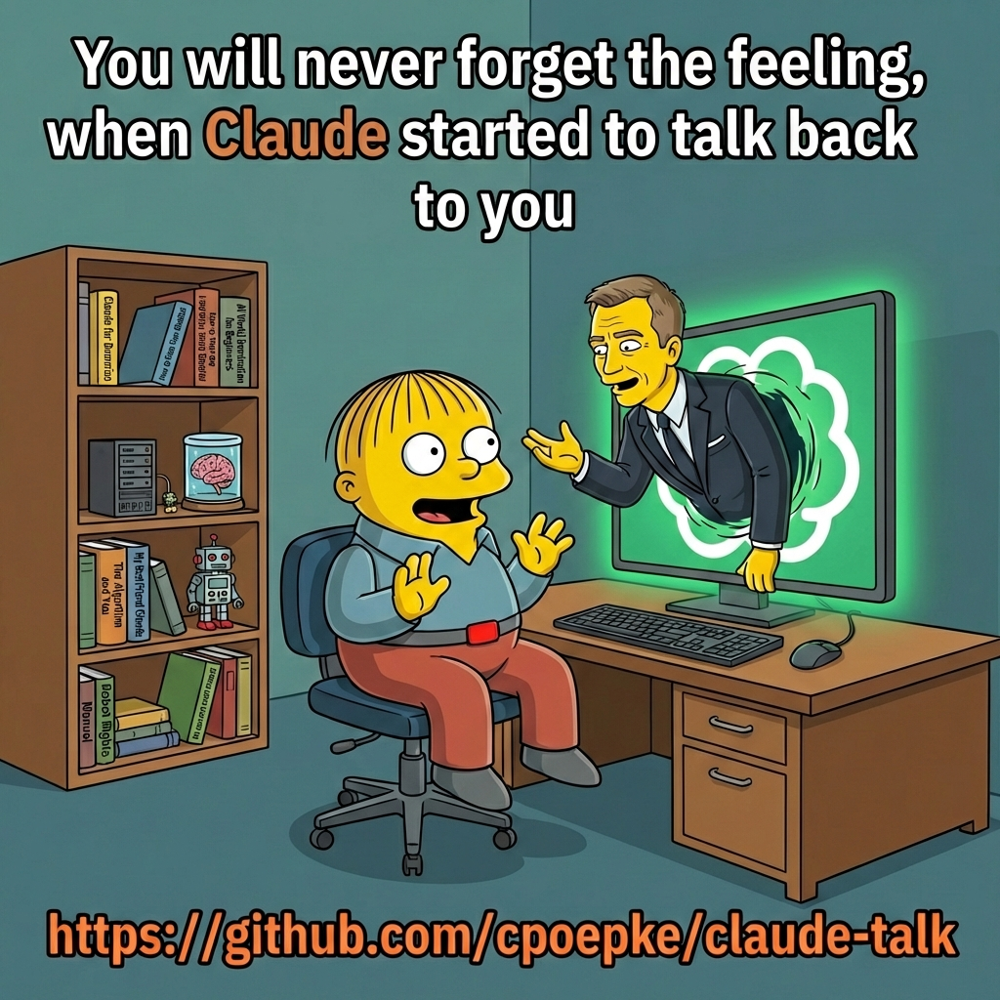

# claude-talk

Talk to Claude Code with your voice. Real-time speech-to-text, conversational AI, and spoken responses - all running locally on your Mac.

> **macOS (Apple Silicon) only** - Requires M1/M2/M3/M4 for MLX-accelerated transcription.

## Why claude-talk?

- **Hands-free coding** — Talk through problems, review code, and give instructions without touching the keyboard
- **Fully local audio** — Transcription runs on-device via Apple's Metal GPU. No audio leaves your machine, ever
- **Real-time streaming** — WhisperLiveKit transcribes as you speak, not after. No awkward pauses waiting for processing
- **Barge-in** — Interrupt Claude mid-sentence by speaking. No waiting for long responses to finish
- **Personalized voice assistant** — Choose a name, voice, personality style, and verbosity level. It remembers who you are
- **Zero-config start** — One install command, then `/claude-talk:start`. That's it
- **Full Claude Code power** — Your voice assistant has the same capabilities as typed Claude Code: file editing, terminal commands, web search, everything

## How it works

```text
You speak                                              Claude responds
    |                                                       |
    v                                                       v
   Mic                                                  Speaker
    |                                                       ^
    v                                                       |
 sounddevice (gain boost)                            macOS say (TTS)
    |                                                       ^
    v                                                       |
 WhisperLiveKit -----> transcribed text ----> Claude Code ---+
 (MLX Metal GPU)       (real-time)           (thinks & replies)
```

Everything runs locally except the Claude API call (via your Claude Code subscription). No audio leaves your machine - transcription happens on-device using Apple's Metal GPU.



## Quick start

### Install the plugin

```bash
# Option A: skills.sh
npx skills add cpoepke/claude-talk

# Option B: Claude Code plugin manager
/plugin install cpoepke/claude-talk

# Option C: Clone manually
git clone https://github.com/cpoepke/claude-talk.git
cd claude-talk
```

### Set up

Open Claude Code in the plugin directory (or any project if installed via Option A/B) and run:

```text
/claude-talk:install
```

This will:

1. Install Python dependencies (WhisperLiveKit, MLX Whisper, sounddevice)
2. Walk you through a **spoken onboarding** - you'll hear each voice, pick a name, choose a personality style, and fine-tune how your assistant behaves

### Start talking

```text
/claude-talk:start
```

Speak into your mic. Claude will listen, think, and respond out loud. Say "stop" or run `/claude-talk:stop` to end the session.

## Onboarding

The install command includes a personality setup where you choose:

| Step | What you pick | How it's presented |
| ---- | ------------- | ----------------- |
| **Voice** | Daniel, Karen, Moira, or Samantha | Each voice speaks a unique sentence so you hear the difference |
| **Name** | Claude, Jarvis, Friday, Nova, or custom | Each name is spoken in your chosen voice |
| **Style** | Casual, Professional, Witty, or Calm | Sample sentences in each style, spoken in your voice |
| **Your name** | First name, "Boss", or nothing | How the assistant addresses you |
| **Verbosity** | Short, Balanced, or Thorough | Controls response length |
| **Custom** | Free text | Any extra personality tweaks ("be sarcastic", "talk like a pirate") |

Your personality is saved to `~/.claude-talk/personality.md` and loaded every time you start a voice chat. Re-run `/claude-talk:install` to change it anytime.

### Multiple Personalities

You can save and switch between multiple personalities:

```text
/claude-talk:personality              # List all personalities
/claude-talk:personality create       # Create a new one (interactive)
/claude-talk:personality switch pirate-claude  # Switch active personality
/claude-talk:personality edit         # Edit the active personality
/claude-talk:personality delete old   # Delete a saved personality
```

Personalities are stored in `~/.claude-talk/personalities/`. Each includes voice, name, style, verbosity, and custom instructions. Switching automatically updates the active voice.

### Default Personalities

Installation includes 9 pre-made personalities you can try immediately:

| Personality | Character | Voice | Style |
|-------------|-----------|-------|-------|
| **bonnie** | Scottish pirate harbour girl, whale hunter's daughter | Fiona (Enhanced) | Witty & playful |
| **claude** | British gentleman with Bond-like wit and radical candor | Daniel (Enhanced) | Witty & playful |
| **crystal** | New Age wellness influencer with mystical energy | Zoe (Premium) | Calm & thoughtful |
| **hank** | American trucker/mechanic with blue-collar wisdom | Evan (Enhanced) | Witty & playful |
| **maeve** | Irish mystical pub storyteller who believes in folklore | Moira (Enhanced) | Calm & thoughtful |
| **sheila** | Australian outback adventurer with Steve Irwin energy | Karen (Premium) | Witty & playful |
| **tash** | Bondi beach surfer girl with laid-back vibes | Karen (Premium) | Casual & warm |
| **vex** | Stranded alien AI calculating path home | Zarvox | Calm & thoughtful |
| **vikram** | Former soldier turned corporate professional | Rishi (Enhanced) | Professional & concise |

Switch with `/claude-talk:personality switch <name>`. Create your own with `/claude-talk:personality create`.

## Commands

| Command | Description |
| ------- | ----------- |
| `/claude-talk:install` | Install dependencies + personality setup |
| `/claude-talk:start` | Start continuous voice chat |
| `/claude-talk:stop` | Stop voice chat |
| `/claude-talk:chat` | Quick single voice exchange (no persistent session) |
| `/claude-talk:config` | View/edit settings |
| `/claude-talk:personality` | Manage personalities (list, create, switch, edit, delete, export, import) |
| `/claude-talk:help` | Show help |

## Requirements

- **macOS** with **Apple Silicon** (M1/M2/M3/M4)
- **Python 3.12** (`brew install python@3.12`)
- **Working microphone**
- **Claude Code** with active subscription

Optional:

- `ffmpeg` - for listing audio devices
- `sox` - for audio analysis/debugging

## Configuration

Settings live in `~/.claude-talk/config.env`:

| Setting | Default | Description |
| ------- | ------- | ----------- |
| `AUDIO_DEVICE` | `1` | Microphone device index |
| `MIC_GAIN` | `8.0` | Gain multiplier (built-in mic needs ~8.0, USB ~1.0) |
| `VOICE` | `Daniel` | macOS TTS voice (use `say -v '?'` to list all; Enhanced variants sound best) |
| `CAPTURE_MODE` | `wlk` | `wlk` (streaming) or `vad` (legacy batch) |
| `SILENCE_SECS` | `2.0` | Seconds of silence to end an utterance |
| `WLK_PORT` | `8090` | WhisperLiveKit server port |

Find your mic device index:

```bash
python3 -c "import sounddevice; print(sounddevice.query_devices())"
```

## Barge-in (interrupt Claude mid-speech)

Barge-in lets you interrupt Claude mid-sentence by speaking. Claude stops talking immediately and listens to what you say instead. Without it, you have to wait for Claude to finish before you can respond.

This requires **BlackHole 2ch** as a virtual audio loopback. Barge-in is enabled by default and silently disables if BlackHole isn't installed.

### Setup

1. Install BlackHole:

   ```bash
   brew install blackhole-2ch
   ```

2. Open **Audio MIDI Setup**, click **+**, select **Create Multi-Output Device**

3. Check both **BlackHole 2ch** and your speakers (speakers should be listed first)

4. Set your system output to the new Multi-Output Device in **System Settings > Sound > Output**

### Barge-in configuration

| Setting | Default | Description |
| ------- | ------- | ----------- |
| `BARGE_IN` | `true` | Set to `false` to force-disable |
| `BLACKHOLE_DEVICE` | (auto) | Explicit device index for BlackHole |
| `BARGE_IN_RATIO` | `0.4` | Mic/reference ratio threshold. Lower = more sensitive |

See the [full barge-in guide](docs/barge-in-setup.md) for how the Geigel detection algorithm works, tuning advice, and troubleshooting.

## Architecture

Voice chat uses a **Stop hook** instead of a teammate — zero extra Claude API overhead. The hook fires after each assistant response, speaks it via TTS, captures the user's next utterance, and injects it back into the conversation. Server-side buffering keeps the mic hot during Claude's thinking time.

For details on the capture pipeline, hook architecture, echo prevention, and microphone gain, see [docs/architecture.md](docs/architecture.md).

## File structure

```text
claude-talk/
├── .claude/
│   ├── hooks/
│   │   └── voice-stop.sh         # Stop hook (voice conversation loop)
│   └── settings.json             # Hook registration
├── .claude-plugin/
│   └── plugin.json               # Plugin manifest
├── skills/
│   ├── install/SKILL.md          # Install + onboarding
│   ├── start/SKILL.md            # Start voice chat
│   ├── stop/SKILL.md             # Stop voice chat
│   ├── chat/SKILL.md             # Quick single exchange
│   ├── config/SKILL.md           # View/edit config
│   ├── personality/SKILL.md       # Personality management
│   └── help/SKILL.md             # Show help
├── src/
│   └── audio-server.py           # Audio server (TTS, capture, barge-in, WLK)
├── scripts/
│   ├── install.sh                # Dependency installer
│   └── ...                       # Legacy capture scripts
├── config/
│   └── defaults.env              # Default configuration
├── CLAUDE.md                     # Plugin context for Claude
├── LICENSE                       # MIT
└── README.md
```

## Troubleshooting

**No speech detected**
- Check your `AUDIO_DEVICE` index - it changes when virtual audio devices (Zoom, Teams) are active
- Increase `MIC_GAIN` if using a built-in microphone

**Whisper outputs `[Music]` or hallucinations**
- `MIC_GAIN` is too high - lower it
- Or lower `VAD_THRESHOLD` to capture quieter speech

**Echo / hearing own response back**
- The audio server handles echo prevention by sequencing TTS and capture. If it persists, increase `SILENCE_SECS`

**WhisperLiveKit won't start**
- Check if port 8090 is in use: `lsof -i :8090`
- Kill existing process: `pkill -f "wlk.*--port"`

**Python 3.12 not found**
- `brew install python@3.12`
- WhisperLiveKit requires 3.12 specifically (not 3.13)

## Privacy

All audio processing happens locally on your Mac:
- **Transcription**: WhisperLiveKit runs Whisper via MLX on your Metal GPU - no cloud API
- **TTS**: macOS built-in `say` command - fully offline
- **Only exception**: The transcribed text is sent to Claude's API for the conversational response (same as typing in Claude Code)

No audio recordings are stored. Temporary WAV files are created in `/tmp/` during capture and immediately deleted after transcription.

## License

MIT
